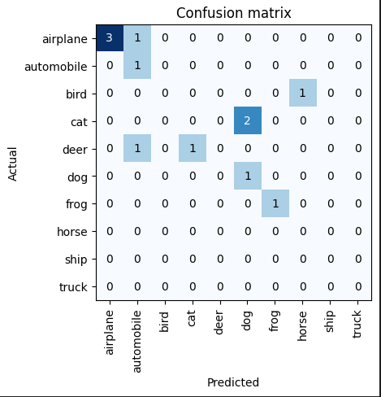
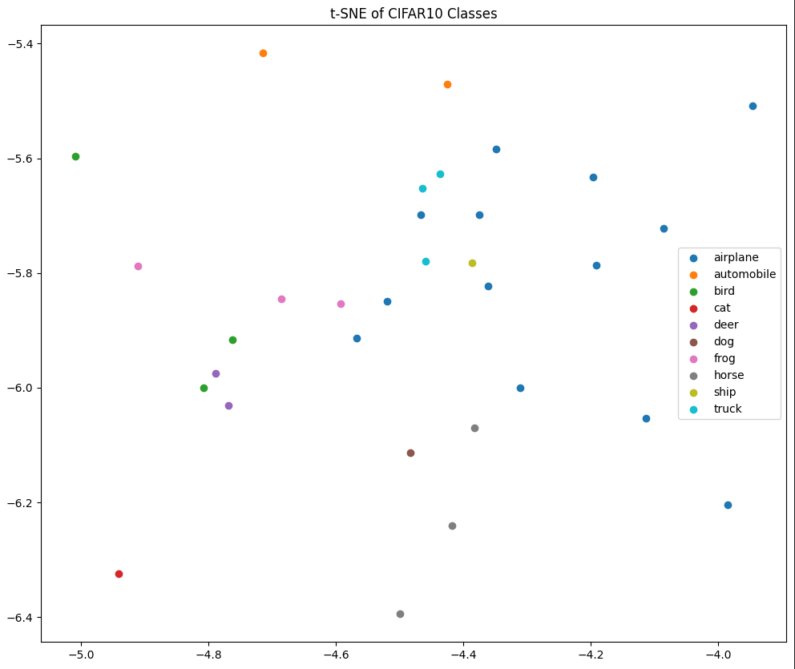

##Question 4  

That one took a lot longer then expected. Atleast 6+ hours of work on the one question but it is finally done. This
question was similar to question 3 in that it involved training a model with a CIFAR-10 dataset, involved 10
data classes. 

Unfortunately whats ended up happening is I wasnt able to download the images as I had done
in question 3 and had to use a predetermined set of 5 images per classwhich is explained in my final report. 
However, perfomance metrics where used to see how well the model performed as show below:
Here is my confusion matrix: 

and my t-SNE scatter plot:

